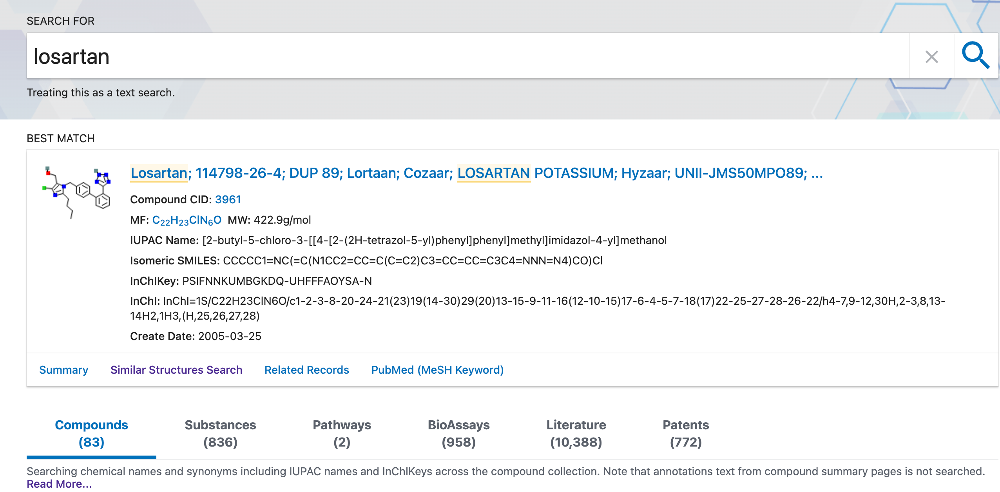

# Manual de Quimioinformática (Universidad Autónoma de México)

## Presentación

La `quimioinformática` se refiere al uso de técnicas computacionales para la resolución
de problemas químicos. Las aspectos principales son:

* Bases de datos moleculares.
* Elucidación y representación de estructuras químicas.
* Síntesis asistida.
* Relación estructura/actividad.

Fases del diseño de fármacos:

1. Investigación sobre las causas moleculares de una enfermedad y del blanco terapeútico.
2. Identificación de compuestos que se unan al blanco o que muestren actividad biológica.
3. Encontrar compuestos con propiedades farmacéuticas atractivas.

## Capítulo 1. Bases de datos: bibliotecas de compuestos químicos

### Introducción

Una base de datos es una estructura organizadad de almacenamiento de información.

La extracción de información se denomina *minería de datos*.

Principales bases de datos químicas:

* [pubchem](https://pubchem.ncbi.nlm.nih.gov/)
* [chemspider](http://www.chemspider.com/)
* [chembl](https://www.ebi.ac.uk/chembl/)
* [drugbank](https://go.drugbank.com/)
* [zinc](https://zinc.docking.org/)

### `Pubchem`

#### Buscando genes y proteinas que interactúen con ciertos compuestos.

1. Introducimos el texto que nos interese en la barra de búsqueda.

2. Pinchamos en `BEST MATCH`
3. Dentro de la sección 16 (Interacciones y rutas biomoleculares) elegimos la subsección 16.2 (Interacciones "DrugBank")

4. Descargamos la lista de moleculas que interactúan en formato `.csv`. Las moléculas se clasifican en cuatro grupos de acuerdo con el tipo de interacción que tengan con el medicamento: *target*, *carrier*, *transporter* o *enzyme*.

#### Encontrar potenciales medicamentos basándose en parecido 2-D
Podemos hacer una búsqueda que no se base en texto, sino en estructura.
También se puede filtrar la búsqueda de manera que sólo se obtengan los compuestos que cumplan una serie de características especificadas.

1. Seguimos los mismos primeros pasos que en el caso anterior, sólo que ahora en la sección `BEST MATCH` elegimos la opción `Similar Structures Search`.
2. Una práctica habitual es filtrar los resultados de manera que sólo se obtengan los compuestos que cumplen las condiciones de Lipinski:
    1. Peso molecular de menos de 500 g/mol.
    2. Donante de como máximo 5 enlaces de hidrógeno.
    3. Aceptor de como máximo 10 enlaces de hidrógeno.
 
#### Encontrar potenciales medicamentos basándose en parecido 3-D
Debido a que las moléculas pueden tener múltiples confórmeros tridimensionles, el puntaje de similitud entre
dos moléculas se obtiene seleccionando el confórmero que haya obtenido la puntuación más alta.Si bien, se pueden considerar hasta 10 confórmeros por molécula, el coste en computación
y tiempo es elevado, por los que la búsqueda se hace en tandas:

1. Compuestos anotados: se consideran 10 confórmeros para cada uno.
2. Compuestos con enlaces a patentes: se consideran 5 confórmeros.
3. Compuestos restantes: se consideran tres confórmeros.